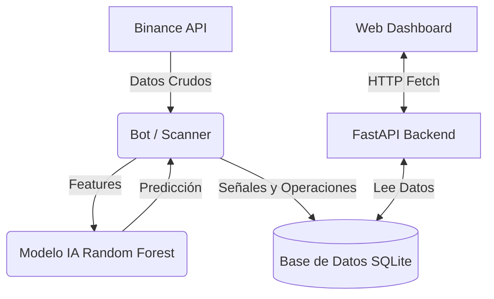

[← Volver al README Principal](../README.md)

# 🏗️ Arquitectura del Sistema

Este documento detalla la estructura técnica del **AI Trading Bot**. El sistema sigue una arquitectura modular desacoplada, donde el "cerebro" (Bot), la "boca" (API) y la "cara" (Frontend) funcionan de manera independiente pero coordinada a través de una base de datos central.

## 📐 Diagrama de Flujo de Datos

## 🧩 Componentes Principales

### 1. El Cerebro (Bot)
Ubicación: `bot/`
Es el núcleo lógico. Se ejecuta como un proceso en segundo plano.
- **`paper_trading.py`**: El bucle principal. Escanea el mercado, gestiona posiciones abiertas, y ejecuta órdenes simuladas.
- **`predict.py`**: Carga el modelo entrenado y genera predicciones (`BUY`/`SELL`/`HOLD`) para un símbolo dado. Contiene los filtros de seguridad (ej. Baja Volatilidad).
- **`train_model.py`**: Script de entrenamiento. Descarga datos históricos, calcula indicadores y entrena el modelo `RandomForestClassifier`.
- **`utils.py`**: Funciones auxiliares para conexión con Binance (`ccxt`) y cálculo de indicadores técnicos (`ta`).

### 2. La API (Backend)
Ubicación: `api/`
Tecnología: **FastAPI**
Sirve como puente entre los datos crudos de la base de datos y la interfaz web.
- **Endpoints**:
    - `/scanner`: Devuelve la última señal para cada moneda escaneada.
    - `/chart-data`: Entrega velas OHLCV para los gráficos.
    - `/balance`, `/trades`, `/statistics`: Información de cuenta y rendimiento.

### 3. La Interfaz (Frontend)
Ubicación: `web/`
Tecnología: **HTML5, CSS3, Vanilla JS**
Diseñado para ser ligero y rápido.
- **`dashboard.js`**: Realiza polling a la API cada 3 segundos para actualizar la UI sin recargar la página.
- **`index.html`**: Estructura visual.
- **`styles.css`**: Tema oscuro profesional ("Dark Mode").

### 4. Almacenamiento (Persistencia)
Ubicación: `database/bot.db`
Tecnología: **SQLite**
Almacena todo el estado del sistema. Esto permite que si reinicias el bot, no pierdas tu historial de operaciones ni tu saldo.
- **Tablas**: `signals` (scanner), `trades` (historial), `balance_history` (evolución de equidad), `logs` (depuración).

## 🔄 Flujo de Ejecución (Ciclo de Vida)

1.  **Start**: El usuario lanza `paper_trading.py`.
2.  **Scan**: El bot itera sobre la lista de símbolos configurada (`config.json`).
3.  **Fetch & Process**: Descarga las últimas 100 velas y calcula MACD, RSI, Bollinger, etc.
4.  **Predict**: La IA evalúa la probabilidad de subida.
    *   *Filtro*: Si la volatilidad es muy baja, se ignora.
5.  **Rank & Sort**: Se ordenan las oportunidades por confianza.
6.  **Execute**: Si (Probabilidad > UmbralCompra) y (Slots Libres > 0), se abre una operación virtual.
7.  **Monitor**: En ciclos siguientes, se vigila el precio para aplicar Stop Loss o Take Profit.
